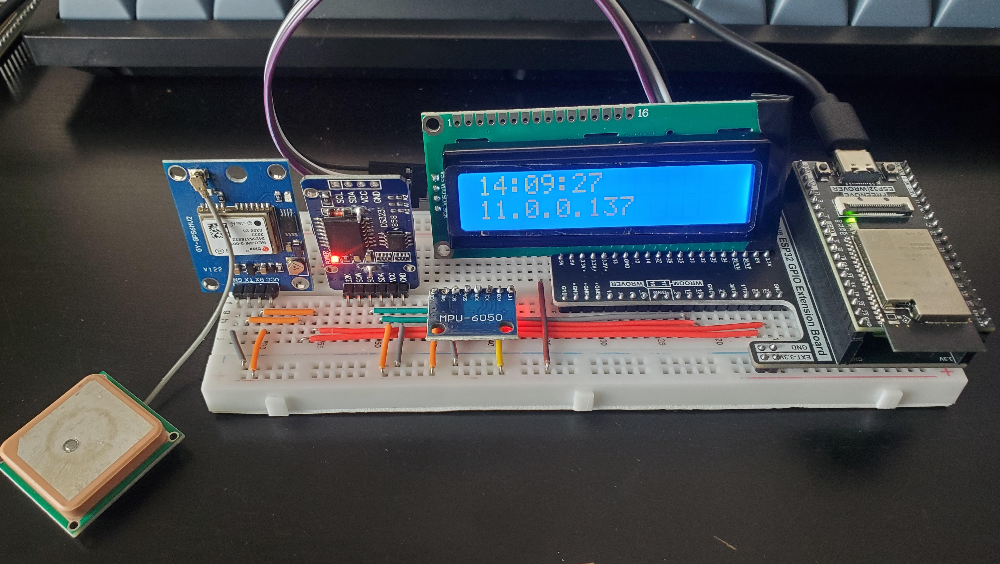

# ESP32 GPS Logger with IMU

A GPS tracking system with acceleration logging and peer-to-peer data synchronisation, designed for ESP32-WROVER-E with SD card storage.



This a project to develop a system to record metrics from static and mobile ESP32 devcies within a limited area with sparadic Wi-Fi Covarage.

Concept: Each ESP32 will collect its own data (GPS and IMU values) and attempt to upload it to a server via Wi-Fi if in range. Some devices will remain somewhat static while others will be mobile. As the ESP32 devices move close to other ESP32 devices, using ESP-NOW, they begin sharing their collected data. As the mobile devices move around, eventually all data will find its way within Wi-Fi range and be uploaded to the server. The server will take care of final parsing while anti-duplication methods are run at share time to reduce data transfer times.

This project is in active development and in the final stages of prototyping before field testing. Expect this code base to change and probably have a few bugs!

## Features

- **GPS Tracking**: Neo-6M GPS module at 5 Hz with EMA position smoothing and position lock for parked devices
- **GPS Quality Filters**: Configurable HDOP, minimum satellite count, and outlier rejection thresholds
- **IMU Data**: MPU6050/MPU6500/MPU9250 6-axis accelerometer and gyroscope with auto-detection and calibration
- **Real-Time Clock**: DS3231 RTC for accurate timestamps when offline
- **Automatic Timezone**: Timezone derived from GPS coordinates on first valid fix (longitude bands with political exceptions)
- **LCD Display** (Optional): LCD1602A shows live GPS, IMU, time, and IP address with auto-off timeout and periodic resync. (Requires 5v)
- **Button Control** (Optional): Toggle LCD display modes with BOOT button; wakes LCD if auto-off is active
- **SD Card Storage**: Unified CSV format with atomic upload staging or backup archiving for safe concurrent access
- **Web Interface**: Dashboard with live GPS data, map visualisation, device configuration, backup management, and OTA firmware updates
- **Multi-AP WiFi**: Scans for strongest available AP from a configurable list; NTP time sync on connect
- **HTTP Upload**: CSV-to-JSON conversion and chunked POST to a configurable server endpoint with backup re-upload
- **ESP-NOW Peer Sync**: When stationary, discovers nearby devices and exchanges CSV data bidirectionally with per-peer watermark tracking
- **Motion Detection**: GPS speed and IMU acceleration/gyroscope data fused to determine stationary state
- **Progressive Power Management**: Four-stage power scaling (Moving → Stage 1 → Stage 2 → Stage 3) that progressively reduces logging frequency, with deep sleep and IMU wake-on-motion at Stage 3. ESP-NOW peer sync remains active in all stages.
- **NVS-Backed Configuration**: All tunable parameters (WiFi APs, thresholds, intervals, upload URL, timezone) stored in NVS, editable at runtime via web UI, with factory reset support
- **OTA Firmware Updates**: Upload new firmware via the web interface

## Architecture

The v2 firmware is split into dedicated modules, each with a single responsibility:

| Module | File | Purpose |
|--------|------|---------|
| GPS | `gps.c/h` | UART driver, NMEA parsing, EMA filtering, position lock, timezone lookup |
| IMU | `imu.c/h` | MPU6050 I2C driver, calibration, static detection |
| RTC | `rtc.c/h` | DS3231 I2C driver, time get/set |
| LCD | `lcd.c/h` | LCD1602A display, auto-off, ISR-safe wake, periodic resync |
| Power | `power.c/h` | Progressive power state machine, deep sleep with IMU wake |
| Config | `config.c/h` | NVS-backed runtime configuration with defaults from `sync_config.h` |
| WiFi Manager | `wifi_manager.c/h` | Multi-AP scanning, connection management, IP reporting |
| Upload | `upload.c/h` | HTTP CSV upload, OTA firmware flashing |
| Web Server | `webserver.c/h` | HTTP server: dashboard, live GPS, config, map, OTA |
| SD Storage | `sd_storage.c/h` | CSV file management, atomic staging, mutex-based concurrent access |
| ESP-NOW Sync | `espnow_sync.c/h` | Peer discovery, chunked data exchange, watermark tracking |
| Data Merge | `data_merge.c/h` | Peer CSV deduplication and merge |

## Hardware

The hardware used in this project should be readily available online and costs around $40 per device. As this project is aimed more towards the syncing and uploading of data, you can substitute any sensor set you wish. You will of course need to update the code to reflect your changes.

### ESP32 Module
I use the Freenove ESP32-WROVER-E dev board for this project. But I think if you are willing to try this you should have no issues modifying this code base to work with just about any ESP32 model. An SD card is required for the project to record large data sets over days or weeks without syncing or uploading.
- ESP32-D0WD-V3 (WROVER or similar with SD card slot)
- 4MB Flash minimum
- Built-in SD card slot (SDMMC interface)

### Sensors

- **GPS**: Neo-6M GPS module
  - RX: GPIO 22
  - TX: GPIO 23
  - Baud: 9600
  - Sample rate: 5 Hz

- **RTC**: DS3231 Real-Time Clock
  - I2C Address: 0x68
  - I2C Bus: I2C_NUM_0 (shared with IMU)
  - SDA: GPIO 18
  - SCL: GPIO 19

- **IMU**: MPU6050/MPU6500/MPU9250 6-Axis IMU
  - I2C Address: 0x69 (AD0 HIGH) or 0x68 (AD0 LOW)
  - I2C Bus: I2C_NUM_0 (shared with RTC)
  - SDA: GPIO 18
  - SCL: GPIO 19
  - Auto-detects compatible sensors at both addresses

- **LCD** (Optional): LCD1602A with I2C backpack
  - I2C Address: 0x27 or 0x3F (auto-detected)
  - I2C Bus: I2C_NUM_1 (dedicated, no bus contention with IMU/RTC)
  - SDA: GPIO 32
  - SCL: GPIO 33
  - Displays GPS fix, speed, altitude, and IMU data
  - Auto-off after 30 seconds of inactivity (configurable)
  - Pulls power from the 5v rail

### SD Card
If your ESP32 does not have a built in SD card reader, you can connect an external reader.

- SDMMC interface (1-bit mode)
  - CMD: GPIO 15
  - CLK: GPIO 14
  - D0: GPIO 2
- FAT32 formatted
- Long filename support enabled

## Pin Configuration

| Component | Pin | GPIO |
|-----------|-----|------|
| GPS RX | GPIO 22 | Input from GPS TX |
| GPS TX | GPIO 23 | Output to GPS RX |
| I2C Bus 0 SDA | GPIO 18 | RTC + IMU |
| I2C Bus 0 SCL | GPIO 19 | RTC + IMU |
| I2C Bus 1 SDA | GPIO 32 | LCD (dedicated) |
| I2C Bus 1 SCL | GPIO 33 | LCD (dedicated) |
| SD CMD | GPIO 15 | SD Card |
| SD CLK | GPIO 14 | SD Card |
| SD D0 | GPIO 2 | SD Card |
| Button | GPIO 0 | BOOT button (built-in) |

## Configuration

### Initial Setup

Copy the example config and fill in your credentials:

```bash
cp main/sync_config.example.h main/sync_config.h
```

Edit `main/sync_config.h` with your WiFi credentials and upload endpoint. The file defines hardware pin assignments and compile-time defaults. On first boot these defaults are written to NVS; subsequent changes can be made at runtime via the web UI.

```c
// WiFi AP list (up to 4 APs — device scans and connects to strongest)
#define DEFAULT_WIFI_AP1_SSID     "Your_SSID"
#define DEFAULT_WIFI_AP1_PASS     "Your_Password"
#define DEFAULT_WIFI_MAX_RETRY    3

// Upload endpoint
#define DEFAULT_UPLOAD_URL        "https://<server>/api/esp/upload"
```

### Runtime Configuration

Once running, all tunable parameters can be changed via the web UI at `http://<ESP32_IP>/config`, including:

- WiFi AP credentials (up to 4 APs)
- Upload URL
- Timezone
- GPS quality filters (HDOP, min satellites, outlier distance, EMA alpha)
- Motion detection thresholds (speed, accel deviation, gyro threshold)
- Logging intervals per power stage
- Stationary stage thresholds
- LCD timeout
- Sync state machine parameters

Use the `/api/reset_config` endpoint to restore all values to compile-time defaults.

## Data Format

### Sync CSV Files

Two CSV files are maintained on the SD card:

- `/sdcard/sync_data.csv` — own records, used for peer exchange and server upload
- `/sdcard/sync_merged.csv` — records received from nearby peer devices

Both files share the same column layout:

```
timestamp,lat,lon,alt,speed,accel_x,accel_y,accel_z,device_mac
```

| Column | Description |
|--------|-------------|
| timestamp | Unix epoch (seconds) |
| lat | Latitude (decimal degrees, 6 decimals) |
| lon | Longitude (decimal degrees, 6 decimals) |
| alt | Altitude (meters, 1 decimal) |
| speed | Speed (km/h, 1 decimal; 0.0 if position unchanged) |
| accel_x, accel_y, accel_z | Acceleration (G-force, 4 decimals) |
| device_mac | Last 4 hex digits of WiFi MAC address |

### Additional Files

- `/sdcard/connections.csv` — peer connection metadata log
- `/sdcard/sync_data.bak`, `/sdcard/sync_merged.bak` — backup archives of uploaded data (sequential numbering)

## Progressive Power Management

The power state machine adapts logging frequency and connectivity based on how long the device has been stationary:

| State | Stationary Duration | Log Interval | WiFi Uploads | ESP-NOW Sync | Deep Sleep |
|-------|-------------------|--------------|--------------|-------------|------------|
| Moving | — | 1 s | Yes | Yes (when static) | No |
| Stage 1 | 3+ minutes | 1 min | Yes | Yes | No |
| Stage 2 | 5+ minutes | 5 min | Periodic | Yes | No |
| Stage 3 | 30+ minutes | 30 min | Periodic | Yes | Yes (IMU wake) |

Motion detected at any stage immediately restores full-rate (1 s) logging.

## Web Interface

When connected to WiFi, access the device at `http://<ESP32_IP>/`

NOTE: The service the data is uploaded to is not part of this project. You will need to provide a URL that can accept the JSON data and return success (200) to trigger file truncation.

### Pages

| Page | Path | Description |
|------|------|-------------|
| Dashboard | `/` | File listing with sizes, backup management |
| Map | `/map` | Map visualisation of GPS data |
| Config | `/config` | Runtime configuration editor |
| OTA | `/ota` | Firmware upload page |

### API Endpoints

| Endpoint | Method | Description |
|----------|--------|-------------|
| `/status` | GET | System status JSON (SD card, sensors, GPS) |
| `/download` | GET | Download a specific file |
| `/clear` | POST | Clear sync data files |
| `/reupload_bak` | POST | Re-upload all backup archive files |
| `/clear_bak` | POST | Delete backup archive files |
| `/api/gps` | GET | Live GPS data as JSON |
| `/api/system` | GET | System information as JSON |
| `/api/config` | GET | Current configuration as JSON |
| `/api/config` | POST | Update configuration values |
| `/api/reset_config` | POST | Reset all config to compile-time defaults |
| `/ota` | POST | Upload and flash new firmware |

## Building and Flashing

### Prerequisites
- ESP-IDF v5.5.2 or compatible
- Python 3.7+

### Build
```bash
idf.py build
```

### Flash
```bash
idf.py -p COM3 flash monitor
```

### Configuration
```bash
idf.py menuconfig
```

Important settings:
- `Component config → FAT Filesystem → Long filename support` = **Heap**
- `Component config → ESP32-specific → Main XTAL frequency` = **40 MHz**

## Operation

### Task Architecture

The firmware runs two pinned FreeRTOS tasks:

- **`gps_logging_task`** (Core 1): Samples GPS at 5 Hz, accumulates and averages IMU readings, applies EMA position filtering, evaluates power state transitions, writes CSV at the current log interval, and updates the LCD
- **`sync_state_machine_task`** (Core 0): Waits for the device to become stationary, then enters a sync loop that alternates between WiFi upload attempts and ESP-NOW peer discovery/exchange rounds

### First Boot
1. NVS initialised; config loaded (or defaults written)
2. I2C buses initialised (Bus 0: RTC + IMU, Bus 1: LCD)
3. LCD splash screen shown ("GPS Tracker v2")
4. IMU calibrated (device must be still)
5. RTC time loaded into system clock
6. SD card mounted; sync CSV files created if absent
7. MAC suffix derived for CSV record identification
8. GPS UART initialised
9. Power manager initialised; deep sleep wake reason checked
10. WiFi connected (strongest AP); NTP time sync started
11. HTTP server started
12. GPS logging task (Core 1) and sync state machine task (Core 0) launched

### GPS Logging
- Logs valid GPS fixes with IMU data once per second
- Creates a new daily file at midnight
- Timezone is initially set from `TIMEZONE` define then updated automatically from GPS coordinates on first valid fix
- Continues logging when WiFi is disconnected; RTC maintains accurate timestamps

### ESP-NOW Peer Synchronisation

When the device is determined to be stationary (GPS speed below 2 km/h and IMU confirms no movement), the sync state machine activates:

1. Broadcasts an ANNOUNCE frame over ESP-NOW to discover nearby devices
2. Responds to peer SYNC_REQ by streaming own `sync_data.csv` in chunks
3. Receives peer CSV data and appends it to `sync_merged.csv`
4. Periodically uploads both `sync_data.csv` and `sync_merged.csv` to `UPLOAD_URL` via HTTP POST
5. On successful upload, the files truncated.
6. When the device starts moving, the sync loop exits and waits for the next stationary period

### Power Management

The system implements progressive power management to conserve battery and reduce SD card wear when devices are stationary for extended periods. The logging rate and upload behavior automatically adjust based on how long the device has been still:

**Power States:**

| State | Stationary Time | Log Interval | WiFi Uploads | ESP-NOW Sync |
|-------|----------------|--------------|--------------|--------------|
| **Moving** | 0-3 minutes | 1 second | Enabled | Active |
| **Stage 1** | 3-5 minutes | 1 minute | Enabled | Active |
| **Stage 2 (Low Power)** | 5+ minutes | 5 minutes | Periodic (5 min) | Active |

**Behavior:**
- Motion detection uses GPS speed (<2 km/h) and IMU data (accelerometer/gyroscope thresholds)
- When motion is detected at any stage, the system immediately returns to full speed logging and uploads
- WiFi power save mode (WIFI_PS_MIN_MODEM) is active in all states to conserve power while maintaining ESP-NOW compatibility
- In Stage 2 (low power), WiFi uploads occur every 5 minutes to ensure data is preserved, and ESP-NOW peer sync remains fully operational
- All thresholds are configurable in `sync_config.h` (`LOG_INTERVAL_*`, `STATIC_STAGE*_THRESHOLD_MS`)

This approach ensures high-resolution tracking when moving while dramatically reducing power consumption and SD card wear when parked, all while maintaining the ability to sync with passing devices via ESP-NOW.

### LCD Display Modes

If an LCD1602A is connected, press the BOOT button (GPIO 0) to toggle between display modes. The button has 300 ms debounce. If the LCD has auto-off'd, pressing the button wakes it.

**Mode 1: GPS/IMU Data**
- Line 1: Speed (km/h) and Altitude (m)
- Line 2: Latitude and Longitude (with GPS fix), or Accelerometer X, Y, Z (without fix)

**Mode 2: Time and IP Address**
- Line 1: Current local time (HH:MM:SS)
- Line 2: WiFi IP address

The LCD turns off automatically after 30 seconds of inactivity. The timeout is controlled by `LCD_TIMEOUT_SEC` in `main.c` (set to 0 to disable auto-off).

## File Management
Note this is not secure, is for testing only and should not be used in production builds.

Log files are automatically organised by date. To manualy download avalaible files:
1. Connect to the same WiFi network as the ESP32
2. Open a web browser to the device IP address
3. Click on a filename to download

Sync files (`sync_data.csv`, `sync_merged.csv`) are managed automatically and deleted after a successful server upload.

## Troubleshooting

### SD Card Issues
- Ensure card is FAT32 formatted
- Check card is properly inserted
- Verify pin connections (CMD=15, CLK=14, D0=2)
- Try a different SD card (some cards do not support 1-bit mode)

### GPS Not Getting Fix
- Ensure clear view of sky
- Wait 30-60 seconds for cold start
- Check antenna connection
- Verify baud rate is 9600
- Check antenna is conencted correctly.

### RTC Not Found
- Check I2C connections (SDA=18, SCL=19)
- Verify I2C address is 0x68
- Ensure pull-up resistors are present (usually internal)

### MPU6050/6500/9250 Not Found
- Check I2C connections (shared with RTC on Bus 0)
- Verify AD0 pin state: AD0 HIGH (3.3V) = address 0x69, AD0 LOW (GND) = address 0x68
- Code auto-detects MPU6050, MPU6500, and MPU9250 variants

### LCD1602A Not Working (Optional)
- Verify I2C backpack is installed on LCD
- Check I2C connections on Bus 1 (SDA=32, SCL=33)
- Code tries addresses 0x27 and 0x3F automatically
- If not found, the system continues without LCD
- Adjust the contrast potentiometer on the I2C backpack if the display is blank

### WiFi Connection Failed
- Verify SSID and password in `sync_config.h`
- Ensure router is in range
- Check MAC address is not filtered

### ESP-NOW Sync Not Working
- Both devices must be on the same WiFi channel (`ESPNOW_CHANNEL` in `sync_config.h`)
- Both devices must be stationary at the same time for a sync round to occur
- Check serial monitor output for ESP-NOW init errors

### CSV Upload Failing
- Verify `UPLOAD_URL` in `sync_config.h` points to a reachable server
- Confirm the server returns HTTP 200 or 201 on a successful POST
- Device must have a WiFi IP address before upload is attempted

## Power Considerations

The system is designed for portable operation:
- GPS: ~50mA active
- IMU: ~3.9mA active
- RTC: ~200uA (continues on backup battery)
- LCD: ~30mA with backlight, ~5mA without
- SD Card: ~100mA during writes, <1mA idle
- ESP32: ~240mA active, can be reduced with sleep modes

## License

This project is provided as-is for educational and development purposes.

## Credits

- ESP-IDF framework by Espressif Systems
- NMEA parsing for GPS data
- DS3231 RTC driver
- MPU6050/MPU6500/MPU9250 IMU driver
